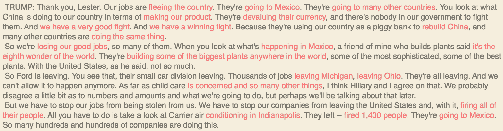
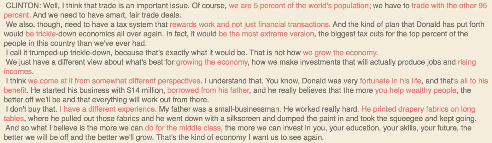

# Debate Anchor Phrases
A quick playground exploring NSLinguisticTagger and BonMot to accent the anchor phrases used by the candidate.

I define an anchor phrase as a sentence that ends with a noun, up to the preceeding verb. I'm sure there are better ways to describe that, but you can look at the code [here](BonMot.playground/Contents.swift) or look at the opening answer by each candidate.

## Trump

## Clinton

Inspired by [this video](https://www.youtube.com/watch?v=_aFo_BV-UzI)
